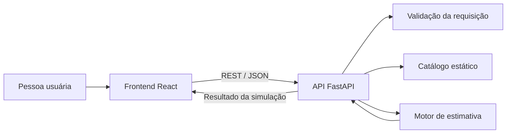

# Arquitetura inicial

## Objetivos arquiteturais

A arquitetura inicial deve manter o Modus simples, testável e fácil de dividir entre colaboradores. O MVP será stateless, sem autenticação, banco de dados ou chamadas para provedores reais de LLM.

## Visão geral



O frontend será o ponto de interação com a pessoa usuária. A API será responsável por validar as escolhas, obter os dados do catálogo, executar a estimativa e devolver um resultado estruturado. Nenhuma parte do MVP fará chamadas para uma LLM real.

## Componentes

### Frontend React

Responsabilidades:

- apresentar o formulário de simulação;
- carregar e exibir o catálogo de modelos;
- enviar as escolhas para a API;
- apresentar tokens, custo, comparação e orientação educativa;
- tratar estados de carregamento, erro e validação;
- manter a interface acessível e responsiva.

O frontend não deve duplicar a regra matemática principal da estimativa. Ele pode formatar valores para apresentação, mas o resultado oficial deve vir da API.

### API FastAPI

Responsabilidades:

- expor os recursos HTTP do MVP;
- validar os dados de entrada e saída com schemas;
- orquestrar o fluxo da simulação;
- acessar o catálogo estático;
- chamar o motor de estimativa;
- padronizar respostas de sucesso e erro;
- publicar a documentação OpenAPI.

A API não manterá estado de sessão nem persistirá simulações nesta fase.

### Catálogo estático

O catálogo será a fonte de dados de referência para os modelos disponíveis, seus valores de custo e metadados necessários à comparação.

Características iniciais:

- mantido no repositório;
- carregado pelo backend;
- sem edição por usuários;
- sem banco de dados;
- atualizado por pull request quando necessário.

O catálogo deve deixar clara a data ou a origem dos valores de referência, pois preços de provedores podem mudar.

### Motor de estimativa

O motor será um componente independente da camada HTTP. Ele receberá um modelo, um tipo de tarefa e um tamanho de resposta e devolverá os tokens estimados e o custo aproximado.

Características desejadas:

- função determinística para as mesmas entradas;
- sem acesso à rede;
- sem dependência de estado de sessão;
- fácil de testar isoladamente;
- separado dos detalhes do FastAPI e do React.

As fórmulas, categorias de tarefa, tamanhos e regras de arredondamento serão detalhados antes da implementação da calculadora.

## Fluxo de dados da simulação

1. O frontend solicita o catálogo disponível.
2. A pessoa usuária escolhe o modelo, o tipo de tarefa e o tamanho da resposta.
3. O frontend envia uma solicitação de estimativa para a API.
4. A API valida os valores recebidos.
5. A API localiza o modelo no catálogo estático.
6. O motor calcula tokens de entrada, tokens de saída, total e custo aproximado.
7. A API devolve o resultado e os dados necessários para a comparação.
8. O frontend apresenta o resultado e a orientação educativa.

## Contrato conceitual da API

Este contrato orienta a divisão entre frontend e backend; os caminhos, nomes exatos e schemas serão definidos durante a implementação.

### Entrada da simulação

- identificador do modelo;
- tipo de tarefa;
- tamanho esperado da resposta.

### Saída da simulação

- tokens de entrada estimados;
- tokens de saída estimados;
- total de tokens;
- custo aproximado;
- moeda utilizada;
- dados para comparação entre modelos;
- orientação educativa;
- indicação de que o resultado é uma estimativa.

### Erros esperados

- campo obrigatório ausente;
- valor de seleção inválido;
- modelo inexistente no catálogo;
- catálogo sem dados suficientes para calcular.

As respostas de erro devem ser compreensíveis para o frontend e não devem expor detalhes internos do servidor.

## Estrutura de diretórios proposta

```text
backend/
  app/
    api/
    domain/
    data/
  tests/

frontend/
  src/
    components/
    services/
    types/
  tests/

specs/
```

Essa é uma organização inicial para orientar o primeiro código. Ela pode ser ajustada por uma issue específica caso a implementação revele uma necessidade melhor.

## Decisões de integração

- o frontend conversa somente com a API, sem acessar diretamente arquivos internos do backend;
- o backend concentra o cálculo para evitar resultados diferentes entre clientes;
- o catálogo estático pertence ao projeto e não depende de disponibilidade de um provedor;
- o MVP não exige autenticação nem envia dados pessoais;
- o CORS deve permitir apenas as origens de desenvolvimento e hospedagem definidas na configuração do projeto;
- segredos não devem ser necessários para executar o MVP.

## Fora do escopo arquitetural

- banco de dados;
- autenticação e autorização;
- integração com APIs de LLM;
- filas e processamento assíncrono;
- cache distribuído;
- painel administrativo;
- infraestrutura de produção;
- observabilidade avançada.

## Critérios de aceite

- [ ] Os componentes e suas responsabilidades estão claros.
- [ ] O fluxo de dados da simulação está documentado.
- [ ] A separação entre apresentação, API, catálogo e cálculo está definida.
- [ ] O contrato conceitual de entrada, saída e erros está registrado.
- [ ] A arquitetura não exige banco, autenticação ou APIs externas no MVP.
- [ ] A estrutura proposta permite dividir o primeiro código entre colaboradores.
- [ ] As fórmulas detalhadas continuam separadas da decisão arquitetural.

## Próximas dependências

- [Issue #7: definir estratégia de testes](https://github.com/thiago-fischer/unifecaf-modus-project/issues/7)
- [Issue #8: configurar integração contínua básica](https://github.com/thiago-fischer/unifecaf-modus-project/issues/8)
